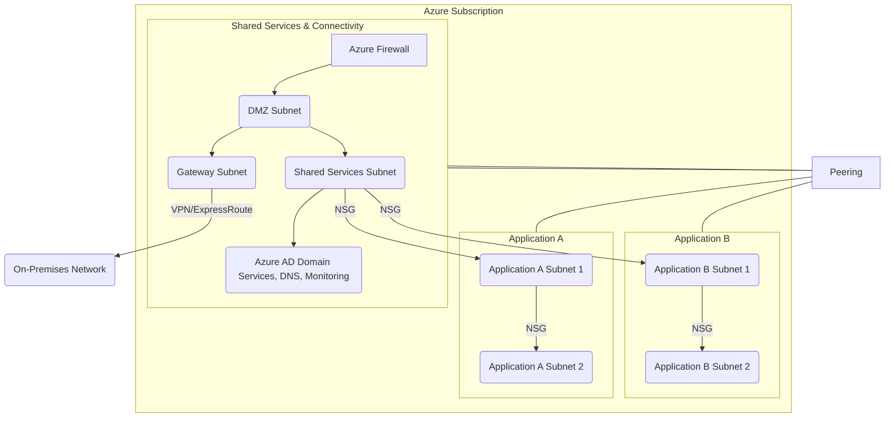

# olions-public
public assets

```mermaid
graph TD
    subgraph Azure Subscription
        subgraph Hub ["Shared Services & Connectivity"]
            A[Azure Firewall] --> B(DMZ Subnet)
            B --> C(Gateway Subnet)
            
            B --> E(Shared Services Subnet)
            E --> F(Azure AD Domain Services, DNS, Monitoring)
        end

        subgraph Spoke1 ["Application A"]
            G(Application A Subnet 1)
            H(Application A Subnet 2)
        end

        subgraph Spoke2 ["Application B"]
            I(Application B Subnet 1)
            J(Application B Subnet 2)
        end
    end

    Hub --- Peering --- Spoke1
    Hub --- Peering --- Spoke2
    C -- VPN/ExpressRoute --> D(On-Premises Network)

    G -- NSG --> H
    I -- NSG --> J
    E -- NSG --> G
    E -- NSG --> I
```
