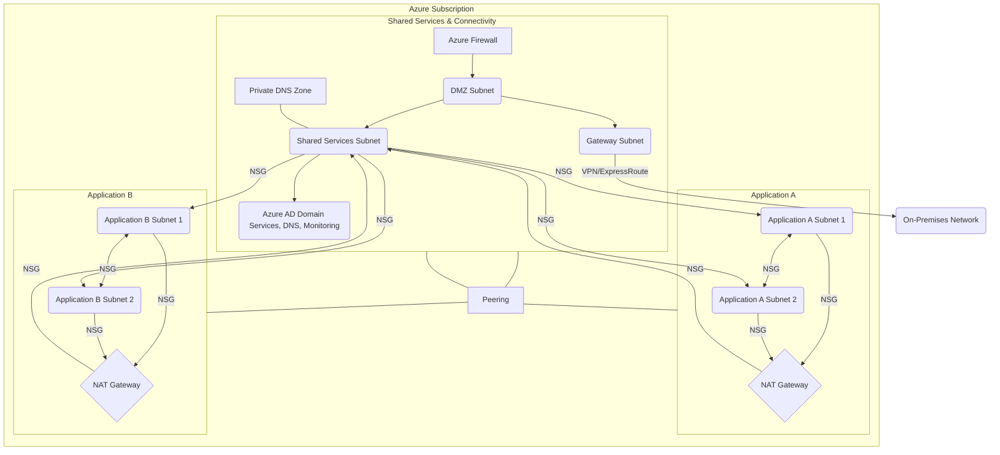

# olions-public
public assets

```mermaid
graph TD
    subgraph Azure Subscription
        subgraph Hub ["Shared Services & Connectivity"]
            A[Azure Firewall] --> B(DMZ Subnet)
            B --> C(Gateway Subnet)
            B --> E(Shared Services Subnet)
            E --> F(Azure AD Domain Services, DNS, Monitoring)
            L[Private DNS Zone] --- E
        end

        subgraph Spoke1 ["Application A"]
            K1{NAT Gateway}
            G(Application A Subnet 1)
            H(Application A Subnet 2)
            G -- NSG --> K1
            H -- NSG --> K1
            G <-- NSG --> H
        end

        subgraph Spoke2 ["Application B"]
            K2{NAT Gateway}
            I(Application B Subnet 1)
            J(Application B Subnet 2)
            I -- NSG --> K2
            J -- NSG --> K2
            I <-- NSG --> J
        end
        
        Hub --- Peering --- Spoke1
        Hub --- Peering --- Spoke2
    end

    
    C -- VPN/ExpressRoute --> D(On-Premises Network)

    K1 -- NSG --> E
    E -- NSG --> G
    E -- NSG --> H

    K2 -- NSG --> E
    E -- NSG --> I
    E -- NSG --> J
    

```

test
